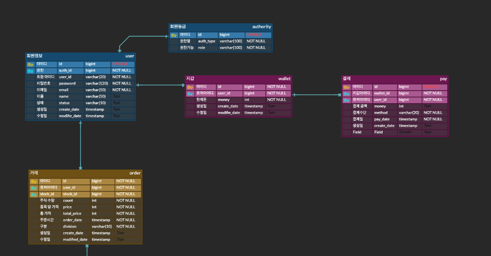
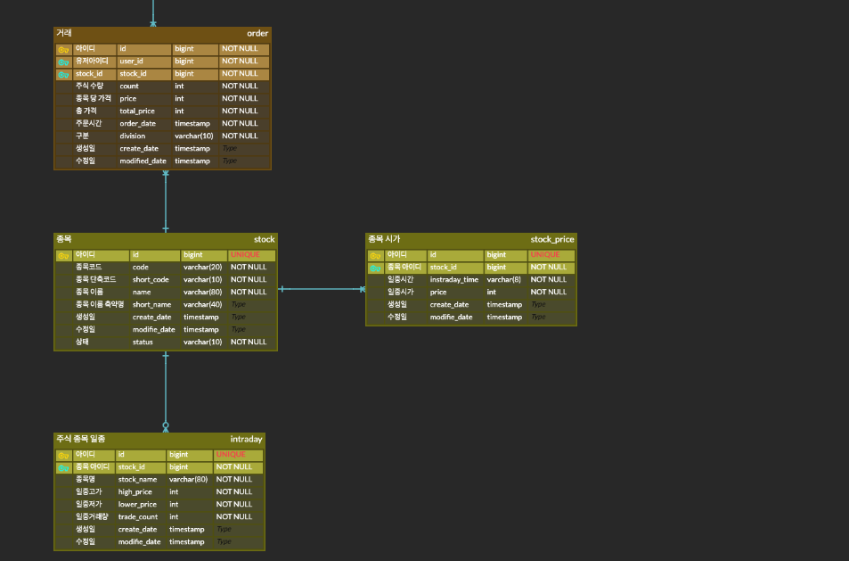

# inversting

## Use Case / 유저 시나리오

### 1. User (일반 사용자)

1. 유저가 로그인한다.
2. 주식 목록을 조회한다.
   1. 주식 종목을 검색한다.
   2. 일일 주식 차트를 확인한다.
    2-1. 구매할 돈이 부족할 경우, 결제를 한다.
3. 주식을 사고 파는 행위를 한다.

### 2. ADMIN (관리자)

1. 어드민으로 로그인을 한다.
2. 일일 판매 거래량을 확인한다.
3. 비정상적인 주식 종목을 정지 시킬 수 있다.

## ERD

1. 회원쪽 테이블

2. 주식종목 테이블

